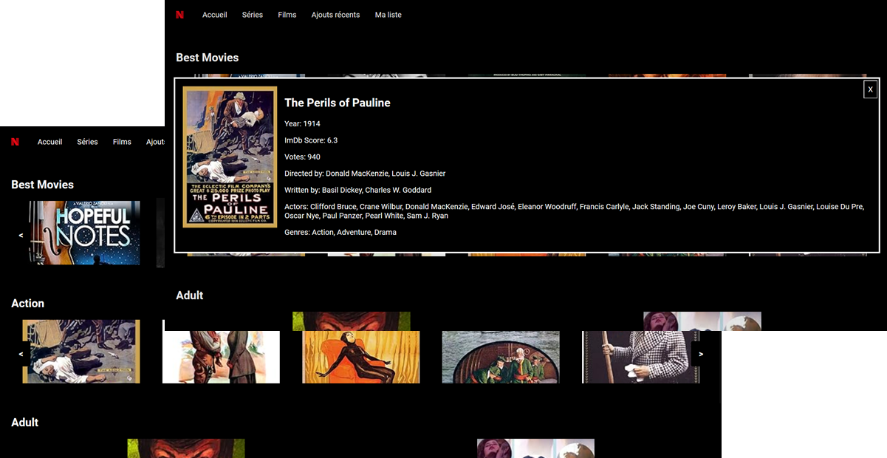
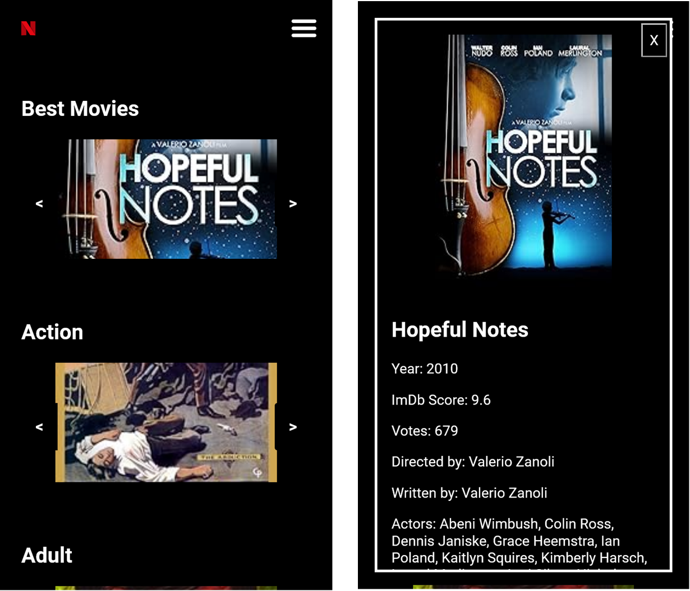

# Carousel Netflix

  


## Description

The goal of this project is to learn to use [Webpack](https://webpack.js.org/), [Babel](https://babeljs.io/docs/) and [Sass](https://sass-lang.com/) to create a clone of Netflix Interface in particular the carousel.

## Clone the project

You can clone this project by downloading [it](https://github.com/Crisxzu/carousel-netflix/archive/refs/heads/main.zip)
Or you can use git command `git clone https://github.com/Crisxzu/carousel-netflix.git`

## Install requirements librairies
[//]: # (TODO: Amélioration de l'intégration
Ca n'est pas obligatoire, ni une faute, mais si tu met :
```shell bash
npm install
```
, tu précise que ton script est conçu pour bash et non powershell ou cmd par exemple.
)
`npm install`

## Build the project

`npm run build`

## Build the docs

``npm run doc``

## Install the project

Copy dist/ directory at the root of your webserver
This version is for testing purposes only and you have to use locahost as REST API Provider. You will need to have the REST API running at locahost.
You can find it at this [link](https://github.com/cGIfl300/OC_P6/tree/master/cloned_api_server/OCMovies-API-EN-FR).

My sincere thanks to Christophe for allowing me to use his REST API code.

## How to add a carousel?

Add the tags to the **index.html** file in dist/ directory were you want the carousel to be.

```HTML
<section class="best-movies">
</section>
```

Where _best-movies_ can be replaced by the category you want to show.

## Docs
You can read the docs of code by opening index.html from out/ directory